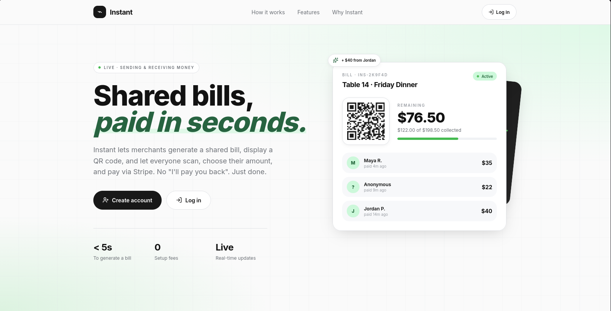

# instant

**Instant** is a fintech solution that enables merchant/users to generate shared bill/invoice and contributor can pay for the bill untill getting charged.



Video about the project : [Youtube](https://www.youtube.com/watch?v=-8foQt7gtG4)

## Overview



## Installation

```sh
git clone git@github.com:abdulazimRabie/instant-web.git
```

```sh
npm install
```

- To Run :

```sh
npm run dev
```

- To Build :

```sh
npm run build
```
